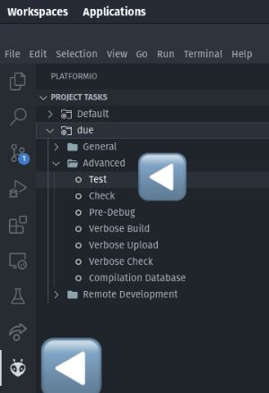

# ATP

Dit is mijn programmeertaal voor het vak ATP

## Een How To:

Er zijn een aantal types:

- getallen
- strings
- ifs
- lussen
- functies

Met getallen kan worden gerekend en vergeleken. Ze kunnen in variabelen worden gestopt en worden geprint.  
Strings kunnen worden geprint en in variabelen gestopt.  
De rest volgt.

Variabelen assignen doe je door middel van `stel`  
`stel a 0` of `stel a "ik ben een tosti"`

Of in het geval van een mee gegeven parameter

`stel a args 0`

waarin `args 0` de eerste functie parameter aanduidt en `args 1` de tweede etc.

Doe dit aan het begin van iedere functie voor alle parameters

De compiler support een totaal van 4 lokale variabelen per functie (inclusief de parameters zodra je ze inlaadt)  
In de praktijk is dit geen echter limitatie, gezien je gewoon maar nieuwe functies kunt blijven maken wanneer je door je ruimte heen bent, om zo gebruik te maken van de stack als extra ruimte. Zie bijvoorbeeld bestanden "gcd.yo" en "greaterthan.yo"

Bij de interpreter maakt het allemaal niet uit, you do you.

Rekenen doe je door middel van `stapel` +, `verklein` -, `verdeel` // en `produceer` \*  
`stapel a 2` : a = a + 2  
`stapel a b` : a = a + b

Andere functies maken doe je met behulp van `definieer`

`definieer mijnfunctie mijnfunctiebestand`

en dan ziet `mijnfunctiebestand.yo` er, bijvoorbeeld, zo uit

```c
stel para args 0
zeg_na "Hello, World!" para
stapel para 1
stel result para
```

Indien er een variabele genaamd "result" aanwezig is, zal die automatisch als returnvalue worden gebruikt.

Een functie aanroepen doe je met behulp van de gedefinieerde naam.

`mijnfunctie resultaat 2 a "ik ben een tosti"`

`resultaat` kun je vervangen met een *ongebruikte* variabelenaam waaronder je het resultaat wilt opslaan.

Mocht dit resultaat je niet interesseren, gebruik dan `leeg` als naam

De interpreter support een oneindig aantal parameters, de compiler 4.

Printen naar de terminal gaat met `zeg_na`

`zeg_na "zo gebruik je zeg_na" 24 b`

Je kunt dus strings, of een getal zoals 24, of een variabelenaam zoals b meegeven, en je kunt ze achter elkaar aan gooien.
Dit zien zowel de interpreter als compiler gewoon als 3 losse zeg_na statements en is slechts syntactic sugar.

Meerdere statements op 1 regel kan, door middel van een `;` tussen de statments

```
stel a 0; stapel a 1; zeg_na a
```

Ook dit is slechts syntactic sugar en dit wordt als 3 losse regels gelext.

Loops kunnen met behulp van `lus` en `sul`  
Het werkt als een "until" loop. Zodra de twee termen die naast sul equivalent zijn, stopt de loop

```c
stel a 3
lus
zeg_na "Hallo, vanuit lus"
verklein a 1
sul a 0
```

If statements zijn heel vergelijkbaar, met `indien` en `neidni`

```c
stel a 2
indien a 0
zeg_na "a is nul"
neidni
indien a 2
zeg_na "a is twee"
neini
```

Voor zowel loops als if's geldt dat je geen nieuwe variabelen kunt assignen binnen hun scope. Doe dit dus van te voren.

Wel kun je loops en if's in elkaar zetten.

## Draaien Interpreter, Compiler, UnitTests

1. Clone dit project
2. Sluit een Arduino Due aan op de pc (Alleen als je de compiler output wilt gebruiken.)
3. Installeer de PlatformIO extensie in VSCode (Optioneel, alleen doen als je wilt unittesten, of zelf geen linker hebt)
4. `python3 main.py compile interpret clean` om te compilen, interpreten of cleanen, of alle drie, of een eigen samenstelling
5. Druk in de sidebar in het platformio menu onder het kopje `due` > `advanced` op `test` om de UnitTest te starten. (PlatformioProject/test/test_main.cpp voor de source van de test)
   1. Vergeet niet te compilen voor het draaien van de unittest

Gecompileerde bestanden `*.S` belanden in PlatformioProject/src/



### Zelf code schrijven

Plaats al je `.yo` bestanden in de map `youriSrc`. Begin met een bestand genaamd `youriMain.yo` Dit is waar de compiler/interpreter begint. Plaats bovenin al je definieer statements van de andere functies. `youriMain.yo` functioneert als zowel je `makefile`, als je `main.cpp` in c++ termen. Alleen bestanden die in een definieer statement voorkomen, zullen worden gecompileerd/interpreteerd.

Als je de code wilt draaien zonder eigen c++ code, plaats dan een main.cpp in de src map. In de root van het project staat een uitgangspunt: `main_template.cpp`

In het PlatformIO menu onder `General` > `Due` staan de build tasks. `Upload and Monitor` bouwt, upload en opent een terminal voor output vanaf de Arduino Due. Gebruik wel eerst `main.py` om de .yo te compilen.

## Eisen

Gekozen taal: Eigen taal

Turing-compleet omdat:
De taal alle basale wiskundige berekeningen uit kan voeren en in staat is conditioneel te branchen met ifs, until loops en functiecalls. Hiermee evenaart het de functionaliteit van brainfuck.

Code is geschreven in functionele stijl.

Taal ondersteunt:
Loops? Voorbeeld: [sommig.yo] - [3], [gcd.yo] - [7], [greaterthan.yo] - [4]  
Goto-statements?  
Voorbeeld in de vorm van een if: [even.yo] - [7&12], [gcd.yo] - [9&12], [greaterthan.yo] - [6&7]  
Voorbeeld functiecall: [odd.yo & even.yo] - [15 in beide files]

Bevat:
Classes met inheritance: bijvoorbeeld [AST.py] - [10-45]  
Object-printing voor elke class: [ja]  
Decorator: functiedefinitie op [lex.py] - [43], toegepast op [lex.py] - [51&64]  
Type-annotatie: Haskell-stijl in comments: [ja]; Python-stijl in functiedefinities: [ja]  
Minstens drie toepassingen van hogere-orde functies:

1. [AST.py] - [110]
2. [compiler.py] - [179]
3. [interpreter] - [64] (interpretMath krijgt de operator op gepassed)

Interpreter-functionaliteit Must-have:  
Functies: [één per file]  
Functie-parameters kunnen meegegeven worden door:  
Het uitvoeren van een functie call in de volgende format  
`functienaam returnvalue parameter1 parameter2 parameter3 parameter4`   
returnvalue is een variabelenaam die niet eerder gebruikt is in de huidige .yo file

Functies kunnen andere functies aanroepen: zie voorbeeld [odd.yo & even.yo] - [15 in beide files]  
Functie resultaat wordt op de volgende manier weergegeven:  
wordt opgeslagen in de eerder genoemde "returnvalue" bij een functiecall
